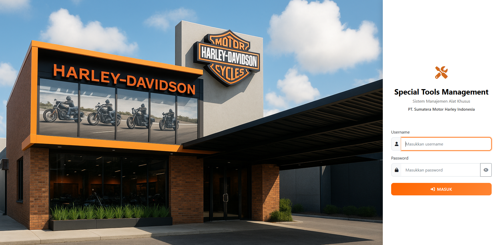
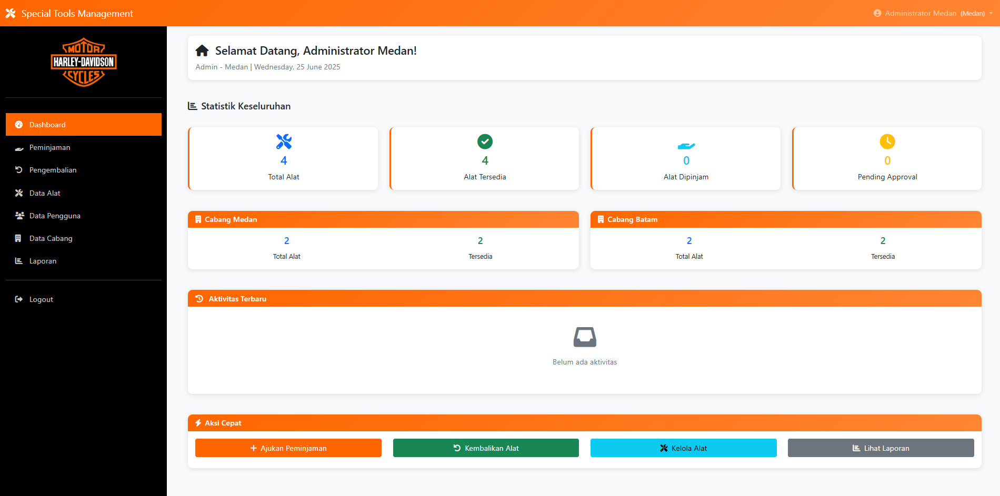
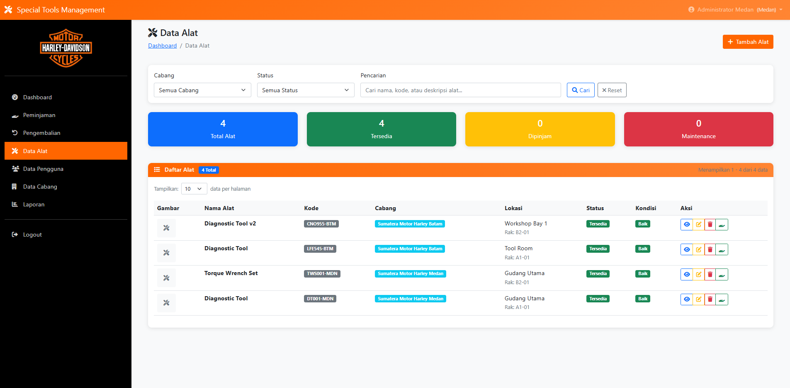
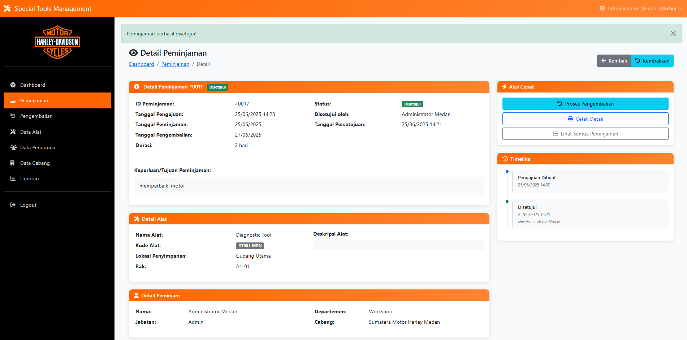
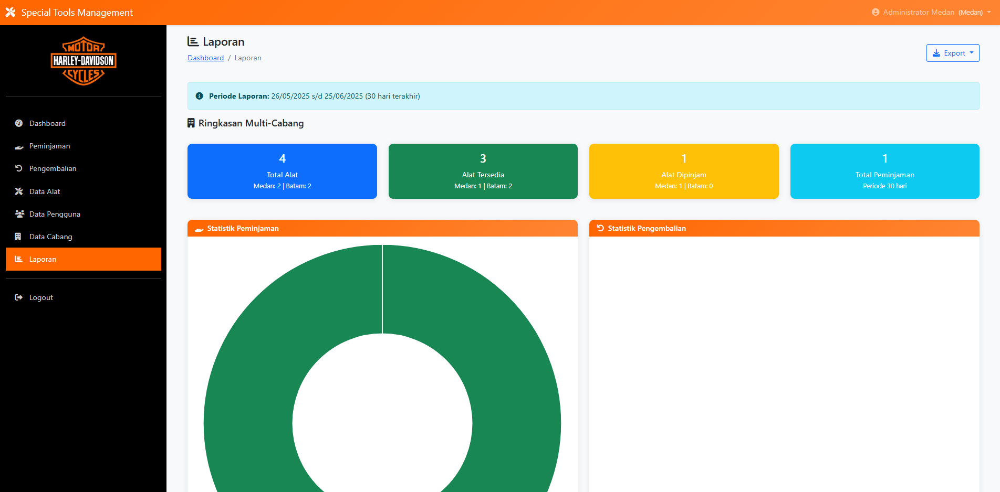

# Special Tools Management System

Sistem Manajemen Inventaris dan Peminajaman Alat dengan dukungan multi-branch dan role-based access. Solusi digital yang mengoptimalkan pengelolaan inventaris dan meningkatkan efisiensi operasional.

## 📸 System Preview

### 🔐 Multi-Role Login

*Secure login dengan access berbeda untuk Admin, Manajer, dan Karyawan*

### 🏠 Dashboard Analytics
  
*Real-time dashboard dengan statistik alat dan distribusi per cabang*

### 🛠️ Asset Management

*Management inventaris dengan foto, spesifikasi, dan tracking lokasi*

### 📦 Workflow System

*Sistem peminjaman dengan approval workflow dan notifications*

### 📊 Reports & Analytics

*Comprehensive reporting dengan insights dan analytics*

## ✨ Key Features

### 🎯 Core Functionality
- **🏢 Multi-Branch Support** - Centralized management untuk cabang 
- **👥 Role-Based Access** - Admin, Manajer, Karyawan dengan permissions berbeda
- **🔍 Real-Time Tracking** - Monitor status dan lokasi semua alat
- **⚡ Automated Workflow** - Approval system dengan notifications
- **📊 Business Analytics** - Reports dan insights untuk decision making
- **🔐 Security System** - Secure authentication dan data protection

### 💡 Smart Features
- Intelligent notifications dan reminders
- Automated reporting dengan custom filters
- Usage analytics untuk optimization
- Mobile responsive untuk field operations

## 👥 User Roles & Access

### 🔧 System Administrator
- Full system control dan user management
- Cross-branch analytics dan monitoring
- System configuration dan security
- Advanced reporting tools

### 👨‍💼 Branch Manager  
- Branch management dan oversight
- Approval workflow control
- Performance analytics dan insights
- Resource planning tools

### 👨‍🔧 Staff/Karyawan
- Request tools
- Real-time status tracking
- Personal usage history
- Quick daily operations

## 🛠️ Technology Stack

### Backend
- **PHP 7.4+** - Modern object-oriented programming
- **MySQL 5.7+** - Optimized database dengan relational design
- **PDO/MySQLi** - Secure database connectivity
- **Session Management** - Advanced security dengan timeout

### Frontend
- **HTML5, CSS3, JavaScript** - Modern web standards
- **Responsive Design** - Mobile-first approach
- **Cross-Browser Support** - Compatible semua major browsers

## 📊 Business Impact

### 🎯 Operational Results
- **Faster Processing** - Reduce time peminjaman dari manual ke digital
- **Better Tracking** - Real-time visibility semua asset perusahaan
- **Improved Efficiency** - Streamlined workflow dan automation
- **Cost Optimization** - Minimize asset loss dan maximize utilization

### 💰 Business Benefits
- Eliminate manual paperwork dan reduce errors
- Improve resource utilization dengan data insights
- Better compliance dengan automated audit trails
- Enhanced productivity dengan mobile access

## 🔒 Security & Performance

### Security Features
- ✅ Secure authentication dengan role-based access
- ✅ SQL injection protection dengan prepared statements
- ✅ Input validation dan sanitization
- ✅ Session security dengan timeout controls
- ✅ Data backup dan recovery procedures

### Performance
- Fast loading times dengan optimized queries
- Mobile-optimized untuk field operations
- Scalable architecture untuk future growth
- Efficient database design

## 📱 Multi-Device Support

- ✅ **Desktop** - Full-featured interface
- ✅ **Laptop** - Professional mobile access
- ✅ **Tablet** - Touch-optimized management
- ✅ **Mobile** - Quick field operations

## 🏆 Portfolio Highlights

### Technical Skills Demonstrated
- **Full-Stack Development** - Complete web application
- **Database Design** - Efficient relational database structure
- **Security Implementation** - Industry-standard security practices
- **User Experience** - Professional interface design
- **Business Analysis** - Understanding business requirements

### Industry Knowledge
- Automotive dealer operations
- Inventory management systems
- Multi-branch business processes
- Staff workflow optimization

## 👨‍💻 Developer

*Full-Stack Web Developer*
**M Ferry Dharmawan**.
**Instagram**: [@m.ferry_dharmawan](https://www.instagram.com/m.ferry_dharmawan/)  

### Core Skills
- PHP Development & Database Design
- Web Security & Performance Optimization
- Responsive Design & User Experience
- Business Process Analysis
- System Integration

## 💼 Professional Services

### Development Services
- ✅ Custom web application development
- ✅ Database design dan optimization
- ✅ System integration dengan existing tools
- ✅ Training dan documentation
- ✅ Ongoing support dan maintenance

### Consultation Available
- Business process analysis
- Technical solution planning
- Custom development projects
- Performance optimization
- Security assessment

**Contact untuk consultation dan custom development projects**

---

**© 2025 Special Tools Management System** | *Developed by M Ferry Dharmawan*
